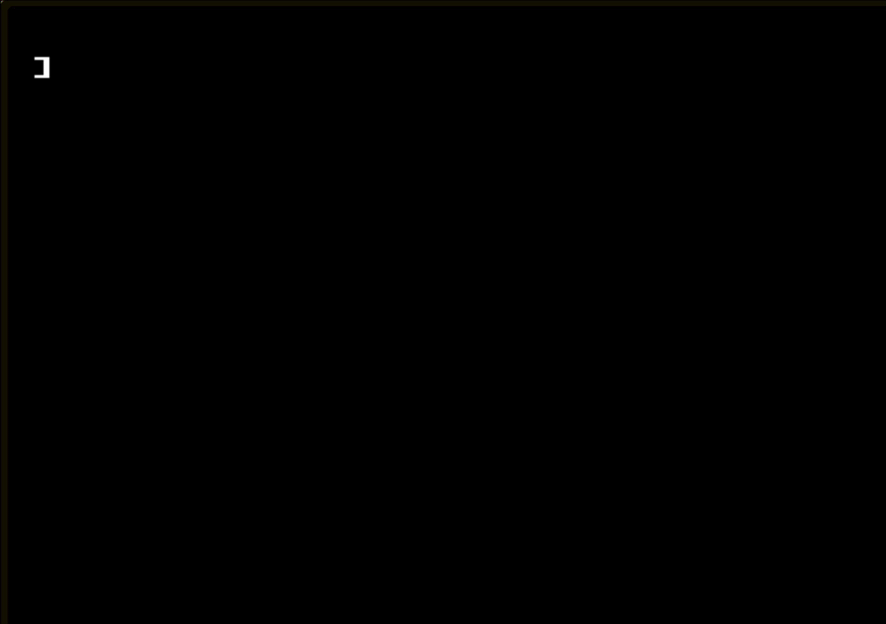
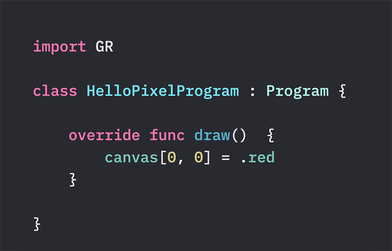
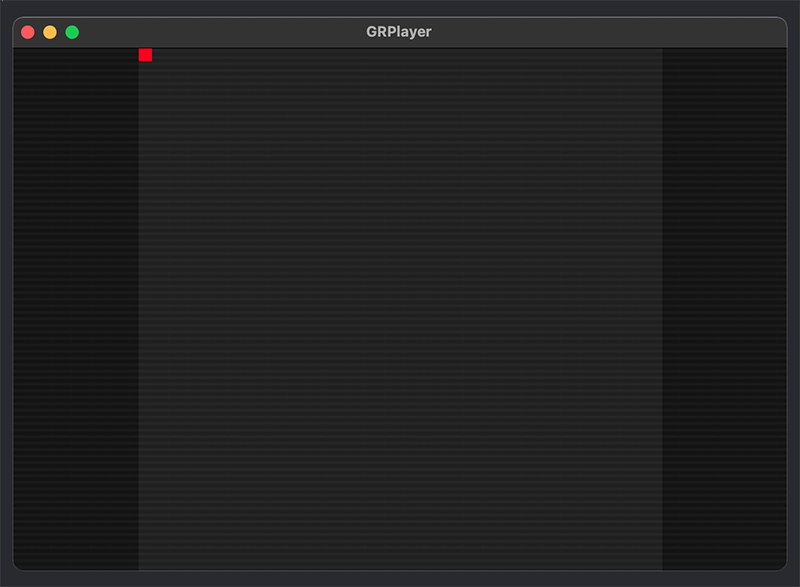
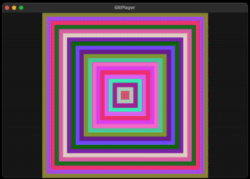
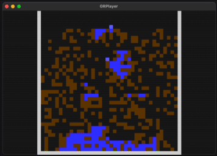
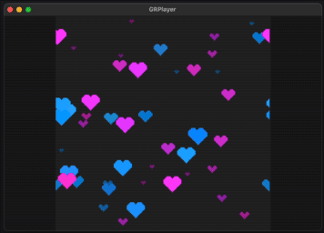
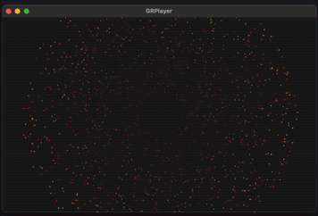
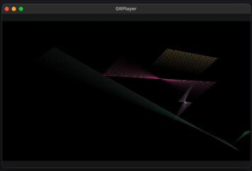
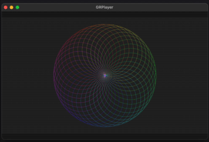
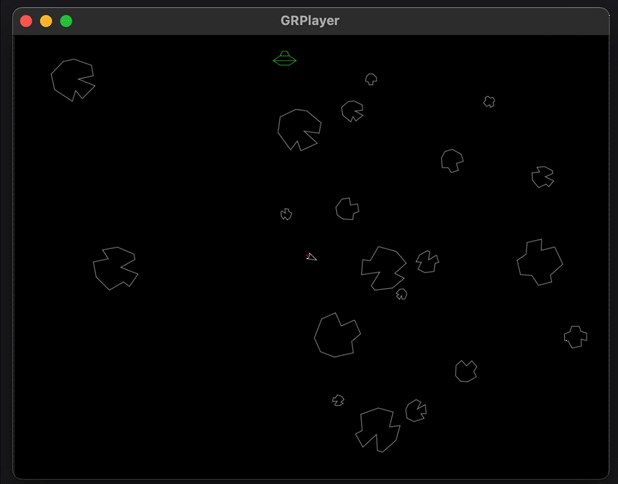

# GR

A framework for learning Swift with pixels. Use [GRPlayer](https://github.com/wolfmcnally/GRPlayer) to check out more programs and write your own.

## Then

I learned programming with pixels on the [Apple //](https://www.scullinsteel.com/apple2/#dos33master).

## Now

You can learn programming with pixels and Swift!

